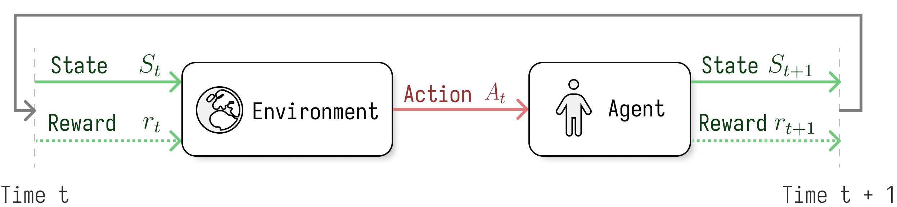

$$
\newcommand{\msf}[1]{\mathsf{#1}}
\newcommand{\mbf}[1]{\mathbf{#1}}
\newcommand{\trop}{\msf{T}}
\newcommand{\polop}{\msf{P}}
\newcommand{\pol}{\pi}
\newcommand{\spX}{\mathcal{X}}
\newcommand{\spA}{\mathcal{A}}
\newcommand{\spOm}{\Omega}
\newcommand{\scal}[2]{\left\langle{#1},{#2}\right\rangle}
\newcommand{\norb}[1]{\bigl\|{#1}\bigr\|}
\newcommand{\nor}[1]{\left\|{#1}\right\|}
\newcommand{\Cb}[1]{C_{b}(#1)}
\newcommand{\Bb}[1]{B_{b}(#1)}
\newcommand{\spM}[1]{\mathcal{M}(#1)}
\newcommand{\EE}{\mathbb E}
\newcommand{\PP}{\mathbb P}
\newcommand{\R}{\mathbb{R}}
\newcommand{\P}{\mathcal{P}}
\newcommand{\Id}{\msf{Id}}
\def\sc#1{\dosc#1\csod} \def\dosc#1#2\csod{{\rm #1{\small #2}}}
$$

# Operator World Models for Reinforcement Learning
P. Novelli, M.Pratticò, M.Pontil, and C. Ciliberto

---

# What is Reinforcement Learning?

- A class of algorithms inspired by how people and animals learns to achieve goals while __interacting with the environment__.
- Interactions are __sequential__, future outcomes depend on past actions.
---
# Many Application Domains

- Robotics and Autonomous Systems
- Financial Trading and Portfolio Optimization
- Energy Management and Smart Grids
- Healthcare and Medical Treatment Planning
- Game Strategy and Complex Decision-Making
- Autonomous Vehicles and Transportation

---
# The interaction Loop

---
# Formalizing the RL problem
## Policy

- A __policy__ defines the agent's behaviour, it can be:
  - __Deterministic__: $A_{t} = \pi(X_{t})$
  - __Stochastic__: $\pi(A_{t}|X_{t}) = \mathbb{P}(A_{t}|X_{t})$
## Reward
- A __reward__ $R_t = r(X_t, A_t)$ is a scalar feedback signal from the environment to the agent.
- The reward function $r$ _defines_ the goal.

<!-- ---
# Value Functions

- The value function is defined as the expected return
$$ V_\pi(x) = \EE\left[\sum_{t=0}^{\infty} \gamma^t r(X_t,A_t) \Big\vert X_0 = x \right].$$
- Similarly, we can define the action-value function (Q-function) as 
$$ Q_\pi(x,a) = \EE\left[\sum_{t=0}^{\infty} \gamma^t r(X_t,A_t) \Big\vert X_0 = x, A_0 = a \right].$$
- $Q_\pi$ and $V_{\pi}$ are related, and 
$$ V_\pi(x) = \EE\left[Q_\pi(X_t, A_t) \Big\vert X_t = x, A_t \thicksim  \pi(X_t) \right].$$ -->
---
# Markov Decision Process 

RL problems are usually framed as __Markov Decision Processes__ with
- State space $\spX$, and action space $\spA$.
- A transition kernel $\tau:\Omega = \spX\times\spA\to\P(\spX)$ such that $X_{t + 1} \sim \tau(\cdot | X_{t}, A_{t})$.
- A (non-negative) reward $r:\spX\times\spA\to\R_+$

>__Details__: We assume $\spX$ and $\spA$ Polish spaces and $\tau, r$ Borel measurable. $\P(\spX)$ the space of Borel probability measures on $\spX$.

---
# Reinforcement learning

We aim to find the policy maximizing the objective
$$J({\color{green}\pol}) = \EE_{{\color{green}\pol}, \tau,\nu}\left[\sum_{t=0}^{\infty} \gamma^t r(X_t,A_t)\right].$$

In contrast to _dynamic programming_ $J(\pol)$, must be optimized **not knowing** the transition kernel $\tau$ nor the reward function $r(X_{t}, A_{t})$.
>__Notation:__ $X_0$, $A_t$ and $X_{t+1}$ have laws respectively $\nu$, $\pi(\cdot|X_t)$ and $\tau(\cdot|X_t,A_t)$ for any $t\in\mathbb{N}$. 
### Two problems to be solved concurrently
1. Policy Optimization
2. Learning from the interaction with the environment

---
# The operator way

Instead of working with probabilities, we use **conditional expectation operators**.

- *Transition operator* $\trop$ associated to $\tau$. 
$$(\trop f)(x, a) = \int_\spX f(x')~\tau(dx'|x,a) = \EE\left[f(X')\mid x, a\right]$$

- *Policy operator* $\polop$ associated to $\pol$

$$(\polop_\pol g)(x) = \int_\spA g(x, a)~\pol(da | x)= \EE\left[g(X,A)\mid X = x\right]$$

With $f,g$ belonging to appropriate spaces of (bounded) functions.

---
# Reformulating RL with operators
The expected reward after a single interaction between a policy $\pol$ and the MDP as
$$\EE[r(X',A')|X_0=x,A_0=a] = (\trop\polop_\pol r)(x,a)$$

---
# Reformulating RL with operators
The expected reward after a single interaction between a policy $\pol$ and the MDP as
$$\EE[r(X',A')|X_0=x,A_0=a] = (\trop\polop_\pol r)(x,a)$$
After $t \in \mathbb{N}$ such steps..
$$\EE[r(X_t,A_t)|X_0=x,A_0=a] = (\trop\polop_\pol r)^t(x,a)$$

---
# Reformulating RL with operators
The expected reward after a single interaction between a policy $\pol$ and the MDP as
$$\EE[r(X',A')|X_0=x,A_0=a] = (\trop\polop_\pol r)(x,a)$$
After $t \in \mathbb{N}$ such steps..
$$\EE[r(X_t,A_t)|X_0=x,A_0=a] = (\trop\polop_\pol r)^t(x,a)$$

Summing all of them up (with $\gamma$-discount) gives the *action-value function* as

$$q_\pol(x,a) = \sum_{t=0}^{\infty} \gamma^t \EE[r(X_t,A_t)|X_0=x,A_0=a] = \sum_{t=0}^{\infty} (\gamma \trop \polop_\pol)^t r = {\color{green}(\Id - \gamma\trop\polop_\pol)^{-1}r}.$$

---

# Optimizing $J(\pol)$: Policy Mirror Descent

---
# Why bothering?
- __Efficiency__: Given a dataset $(x_{i}, a_{i}, x'_{i}, r_{i})_{i = 1}^{T}$, the operator $\trop$ can be _learned from data_ via Conditional Mean Embeddings (CMEs)
- __Simplicity__: Combining CMEs with standard scalar regression for the reward $r$ we estimate the action value function $q_{\pol}$ _in closed form via matrix operations_.
- __No extra sampling__: CMEs estimate expectations without any additional sampling and incur only in model error, for which learning bounds are available.

---
# Our algorithm: POWR
## Policy mirror descent wit Operator World models for RL
1. __Exploration__: Estimate $\trop$ and $r$ from data using CMEs. Combine them to get an approximation of the action value function $\hat{q}_{\pol}$.
2. __Planning__: Compute the mirror descent update $\pol_{t + 1}(\cdot | x) = {\sc{SOFTMAX}} \left(\log(\pol_{0}(\cdot |x)) + \eta\sum_{s = 0}^{t} \hat{q}_{\pol_{s}}(x, \cdot)\right)$

--- 
# POWR converges to the global optimum.
## Theorem (informal)
Let $(\pol_{t})_{t \in \mathbb{N}}$ be a sequence of policies generated by POWR. If the action-value functions $\hat{q}_{\pol_{t}}$ are estimated from a dataset $(x_{i}, a_{i}; x_{i}')_{i = 1}^{n}$ with $(x_{i}, a_{i}) \sim \rho \in \mathcal{P}(\spOm)$, the iterates converge to the optimal policy as 
$$
    J(\pol_{*}) - J(\pol_{T}) \leq O\left(\frac{1}{T} + \delta^{2} n^{-\alpha}\right)
$$
with probability not less than $1 - 4e^{-\delta}$ and $\alpha < 1$. Here and $\pol_{*}:\spX \to \Delta(\spA)$ is a measurable maximizer of $J$.

---
# Experimental results
## `https://github.com/CSML-IIT-UCL/powr`